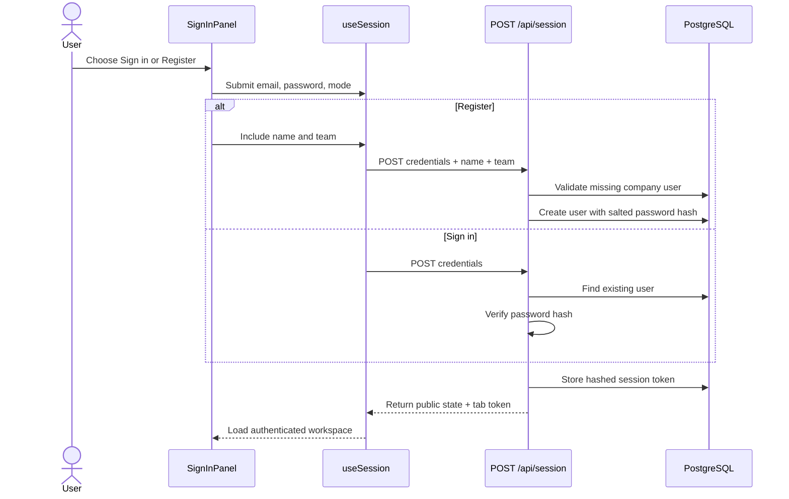
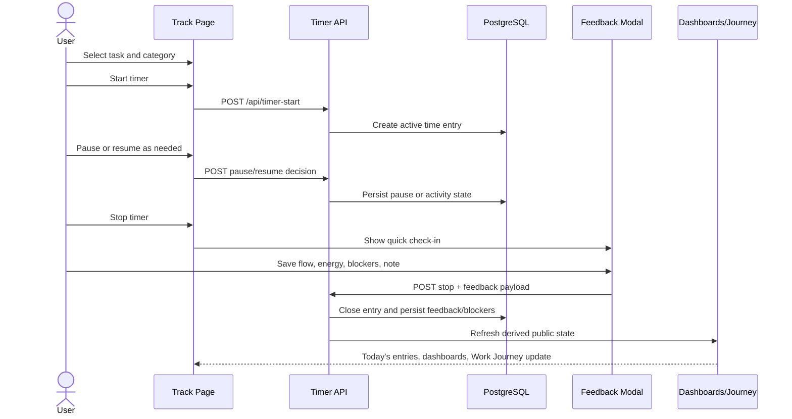
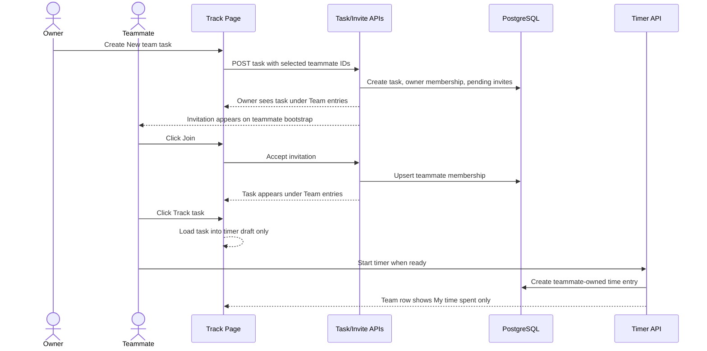

# AirGradient Time Tracker Handoff Guide

This guide is for the next person taking over the AirGradient Time Tracker work. Start here to understand the repository shape, current product direction, important decisions, operational notes, and the remaining gaps.

## 1. Project Structure

```text
backend/
  api/         Nitro API routes for auth, bootstrap, timer, tasks, invitations,
               entries, dashboards, export, settings, health, and Breezy.
  prisma/      Prisma schema, migrations, and seed data.
  utils/       Server-side auth, Prisma client, validation, DB store, account
               settings, dashboard builders, timer/activity logic, and exports.

frontend/
  app.vue      Main app shell. Coordinates auth, navigation, timer lifecycle,
               task creation, shared-task flows, dashboards, settings, and export.
  assets/      Main CSS theme and layout system.
  components/  Shared UI components such as charts and modal primitives.
  composables/ API/session/theme helpers.
  features/
    auth/       Sign in/register card and session orchestration.
    breezy/     Breezy companion, nudges, and Work Journey UI.
    dashboard/  Personal and Company dashboard UI.
    export/     Raw-data export helpers.
    settings/   Account menu and Settings page.
    tracking/   Timer panel, entries, feedback, idle decisions, tasks, sharing.

shared/
  constants/   Canonical category/team list and system settings constants.
  types/       Shared TypeScript domain types.
  utils/       Shared time, URL, theme, Breezy, and dashboard helpers.

docs/
  spec.md          Preserved product brief plus updated ASCII/UI direction.
  specs/features/  Feature-level specs. Read the relevant one before behavior changes.
  operations/      Production runbook.
  milestones.md    Current milestone status, verification evidence, and known gaps.
  handoff/         Handoff documents such as this guide.

tests/
  unit/         Pure logic and API helper tests.
  component/    Vue component and app workflow tests.
  integration/  PostgreSQL-backed API, persistence, and permission tests.

scripts/
  production/config and backup verification helpers.
```

The app is a Nuxt 3 project with `srcDir` set to `frontend` and `serverDir` set to `backend`. Runtime behavior should go through backend API routes and Prisma-backed PostgreSQL persistence.

## 2. Product Purpose

The product has two equally important goals:

- Give each person a clear, exportable record of their own time, focus quality, blockers, and working patterns.
- Give the company aggregated process insight without turning personal data into individual performance rankings.

The app is an internal productivity tool, not a billing system or employee-ranking system.

## 3. Product Boundaries

Do not add:

- Billable hours, hourly rates, salary, earnings, or client billing.
- Individual performance leaderboards.
- Company views that rank people.
- Raw app names, website URLs, screenshots, or private destination details for context switches.
- Marketing landing pages.
- Client-only persistence for production behavior.

Context-switch tracking stores counts only. Company views must stay aggregate and process-focused.

## 4. Docs To Read Before Changes

Start with:

```text
README.md
docs/spec.md
docs/milestones.md
docs/operations/production-runbook.md
```

Then read the relevant feature spec:

```text
docs/specs/features/01-authentication-profile.spec.md
docs/specs/features/02-tasks-categories-collaboration.spec.md
docs/specs/features/03-timer-tracking-entries.spec.md
docs/specs/features/04-feedback-blockers.spec.md
docs/specs/features/05-idle-context-settings.spec.md
docs/specs/features/06-personal-dashboard.spec.md
docs/specs/features/07-company-dashboard.spec.md
docs/specs/features/08-breezy-companion.spec.md
docs/specs/features/09-breezy-journey.spec.md
docs/specs/features/10-medals.spec.md
docs/specs/features/11-raw-data-export.spec.md
docs/specs/features/13-data-persistence-audit.spec.md
docs/specs/features/14-accessibility-verification.spec.md
```

## 5. Current Feature State

### Authentication And Account

- The signed-out page opens directly to the account card.
- `Sign in` is for existing users and asks for work email and password.
- `Register` creates a missing `@airgradient.com` user when self-registration is enabled.
- Register asks for work email, name, team, and password.
- Team uses the same canonical list as task categories: Software, Hardware, Firmware, Communication, Research, Commerce, Production, Other.
- Passwords are hashed server-side with scrypt and a unique salt.
- Sign-in never creates a missing user.
- Account settings live behind the profile card in the sidebar.

Relevant files:

- `frontend/features/auth/SignInPanel.vue`
- `frontend/features/auth/useSession.ts`
- `backend/api/session.post.ts`
- `backend/api/session.delete.ts`
- `backend/api/bootstrap.get.ts`
- `frontend/features/settings/`
- `docs/specs/features/01-authentication-profile.spec.md`

### Track Page And Time Entries

- Users can create/select a task, pick a category, and start/pause/resume/stop the timer.
- Manual entries support retroactive time logging.
- End-of-session feedback captures flow, efficiency, energy, blockers, and an optional note.
- Today's entries show tracked/manual work and editing actions.
- Inactive time handling is server-authoritative.

Relevant files:

- `frontend/features/tracking/TimerPanel.vue`
- `frontend/features/tracking/EntryHistory.vue`
- `frontend/features/tracking/FeedbackModal.vue`
- `frontend/features/tracking/IdleDecisionModal.vue`
- `backend/api/timer*.ts`
- `backend/api/entries*.ts`
- `backend/utils/store.ts`
- `docs/specs/features/03-timer-tracking-entries.spec.md`
- `docs/specs/features/04-feedback-blockers.spec.md`
- `docs/specs/features/05-idle-context-settings.spec.md`

### Shared Tasks And Team Entries

- The Track-page action is `New team task`.
- It is collaboration-only and requires selecting at least one existing teammate.
- Creating a Team task does not start the timer.
- The owner sees the new Team task immediately under `Today's entries` -> `Team`.
- Invitees see a notification-style task invitation and can choose `Join`.
- Joining adds the task to Team entries but does not start tracking.
- `Track task` loads the Team task into the timer draft.
- `Cancel` clears the draft if tracking has not started.
- Each person tracks only their own time on a shared task.
- Team rows show members and `My time spent`, not other people's tracked duration.

Relevant files:

- `frontend/features/tracking/TaskModal.vue`
- `frontend/features/tracking/EntryHistory.vue`
- `frontend/features/tracking/useTasks.ts`
- `backend/api/tasks.post.ts`
- `backend/api/invitations.post.ts`
- `backend/utils/store.ts`
- `docs/specs/features/02-tasks-categories-collaboration.spec.md`

### Personal Dashboard

- Private to the signed-in user.
- Shows selected-week personal hours and Work overview.
- One configurable chart supports metric/grouping choices.
- Shows Work signals, Blocker patterns, Medals, and CSV export.
- The current UI intentionally removed AI suggestions and task estimates.

Relevant files:

- `frontend/features/dashboard/PersonalDashboard.vue`
- `frontend/components/WorkOverviewChart.vue`
- `backend/api/personal-dashboard.get.ts`
- `backend/utils/store.ts`
- `docs/specs/features/06-personal-dashboard.spec.md`

### Company Dashboard

- Aggregate process insight only.
- No individual ranking.
- No personal raw entry details.
- Uses category/team-level rollups and aggregate shared-task signals.
- Category/team wording should stay consistent with the current product direction.

Relevant files:

- `frontend/features/dashboard/CompanyDashboard.vue`
- `backend/api/company-dashboard.get.ts`
- `backend/utils/store.ts`
- `docs/specs/features/07-company-dashboard.spec.md`

### Breezy And Work Journey

- Breezy is the companion/nudge layer for the timer.
- Work Journey is a weekly timeline of completed work entries.
- Journey segments represent completed work entries across the week and show entry details via click/selection.
- The Journey should help users review what they completed, not duplicate the dashboard's aggregate chart.

Relevant files:

- `frontend/features/breezy/BreezyPanel.vue`
- `frontend/features/breezy/BreezyJourney.vue`
- `frontend/features/breezy/BreezyNudgeToast.vue`
- `shared/utils/breezy.mjs`
- `backend/utils/store.ts`
- `docs/specs/features/08-breezy-companion.spec.md`
- `docs/specs/features/09-breezy-journey.spec.md`

### Export

- Personal raw CSV export is exposed from the Personal dashboard.
- Export must remain scoped to the signed-in user's own detailed data.
- JSON export exists at the API layer but is not the current primary UI action.

Relevant files:

- `frontend/features/export/`
- `backend/api/export.get.ts`
- `docs/specs/features/11-raw-data-export.spec.md`

## 6. Important Product Decisions

- Team and Category share the same canonical values.
- `Team` in account/settings means the user's real work team, but it uses the category list to avoid competing taxonomies.
- Shared-task time summaries show only `My time spent`.
- Joining a shared task never auto-starts the timer.
- Production does not seed demo data automatically.
- AI suggestions are removed/deferred.
- Task estimates are removed/deferred.
- Company dashboard must stay aggregate and non-ranking.
- Register collects Name and Team up front.
- The app uses password auth only for now; mailbox verification and password reset are deferred.

## 7. Workflow Sequence Diagrams

These diagrams show the current expected behavior at a handoff level. Keep them aligned when the corresponding product flow changes.

### Register Or Sign In



### Track Time And Save Feedback



### Shared Team Task Invite And Tracking



## 8. Local Setup

From the project checkout:

```bash
npm install
cp .env.example .env
docker compose -p ag-time-tracker-software -f docker-compose.dev.yml up -d postgres
npx prisma migrate deploy
npm run db:seed
npm run dev
```

Open:

```text
http://localhost:3000/tracker/
```

Seeded demo users:

```text
siri@airgradient.com
jack@airgradient.com
jay@airgradient.com
```

Password:

```text
demo-password
```

If port 3000 is already used:

```bash
npm run dev -- --port 3100
```

## 9. Production Setup And Deployment

Production is served at:

```text
https://tools.airgradient.net/tracker
```

Production Compose runs its own PostgreSQL container and stores data in a Docker volume. The production `.env.production` file lives on the server and must not be committed or pasted into chat.

The default runbook path is:

```bash
cd /opt/apps/tracker
```

Deployment uses:

```bash
./deploy.sh
```

The script pulls the latest fast-forward `main`, builds a timestamped Docker image, runs Prisma migrations, and starts the web container. The Docker build runs `npm run verify:production`, so the production host does not need Node.js or npm installed for deploy.

Every production migration/deployment must follow:

```text
docs/operations/production-runbook.md
```

Important production note:

- Production runs migrations, not seed data.
- If a production user can sign in but sees empty dashboards, check whether that production user has production tasks and entries.
- Local seed data and test fixtures do not appear in production automatically.

## 10. Production DB Checks

Run these only after SSHing into the production server and entering the production checkout.

Confirm services:

```bash
docker compose -f docker-compose.prod.yml --env-file .env.production ps
```

Check users:

```bash
docker compose -f docker-compose.prod.yml --env-file .env.production exec postgres \
  psql -U "${POSTGRES_USER:-postgres}" -d "${POSTGRES_DB:-ag_time_tracker}" \
  -c "select email, display_name, team, created_at from users order by created_at desc limit 20;"
```

Check whether a user has production tasks and entries:

```bash
docker compose -f docker-compose.prod.yml --env-file .env.production exec postgres \
  psql -U "${POSTGRES_USER:-postgres}" -d "${POSTGRES_DB:-ag_time_tracker}" \
  -c "select u.email, count(distinct t.id) as tasks, count(distinct e.id) as entries from users u left join tasks t on t.owner_id = u.id left join time_entries e on e.user_id = u.id where u.email ilike '%mog%' group by u.email;"
```

Never expose `.env.production`, `DATABASE_URL`, `POSTGRES_PASSWORD`, `NUXT_SESSION_PASSWORD`, production backups, or raw production exports.

## 11. Testing Checklist

Fast useful checks:

```bash
npm run test
npm run test:component
npm run test:integration
npm run lint
npm run build
git diff --check
```

Useful manual/browser flows:

- Sign in with a seeded demo user.
- Register a new `@airgradient.com` user and confirm Name/Team save.
- Create an individual task and track time.
- Stop the timer and save feedback/blockers.
- Create a `New team task` with a teammate.
- Confirm the owner sees the Team task before invite acceptance.
- Accept an invite as the teammate.
- Confirm Team task shows `My time spent` only.
- Track a Team task from `Track task`.
- Add a manual entry.
- Check Personal dashboard week controls and CSV export.
- Check Company dashboard aggregate view.
- Check Work Journey segment selection/details.
- Check Settings profile/team update.

## 12. Known Gaps And Deferred Work

Keep `docs/milestones.md` as the source of truth for milestone status. Current important gaps include:

- No admin UI for production data inspection.
- No email verification.
- No password reset/account recovery.
- No multi-factor authentication.
- No full user-defined category management.
- No full client/project management workflow.
- Owner-only archive/remove collaborators are deferred.
- Full collaborator management view is incomplete.
- Native desktop app identification for context switches is intentionally unavailable/deferred.
- Automated accessibility scanning and full Playwright E2E remain open.
- Production dependency audit remains blocked by known Prisma-chain high findings recorded in `docs/milestones.md`.

## 13. Privacy And Data Notes

- Individuals can see/export their own detailed raw data.
- Company surfaces must remain aggregate.
- Shared tasks are opt-in collaborative work; members can see who belongs to the task, but should not see another member's duration.
- Context-switch tracking stores counts only.
- Do not add destination URLs, app names, website names, screenshots, or private activity detail.
- API routes must enforce authenticated access and task membership/ownership rules server-side.

## 14. Open Questions For The Next Owner

- Should production get a small admin-only data inspection surface, or should DB inspection remain server-only?
- Should registration remain open to all `@airgradient.com` addresses, or move to invite-only/mailbox verification?
- Should Team and Category stay the same long term, or split after the company dashboard stabilizes?
- What minimum accessibility verification should block production deploy?
- When Prisma resolves the current audit chain, should the dependency update become the next production-readiness priority?
