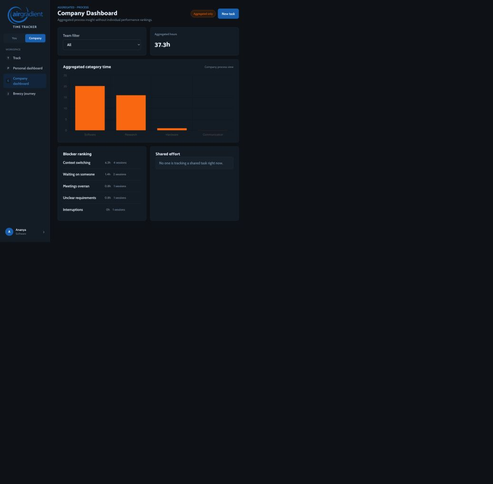
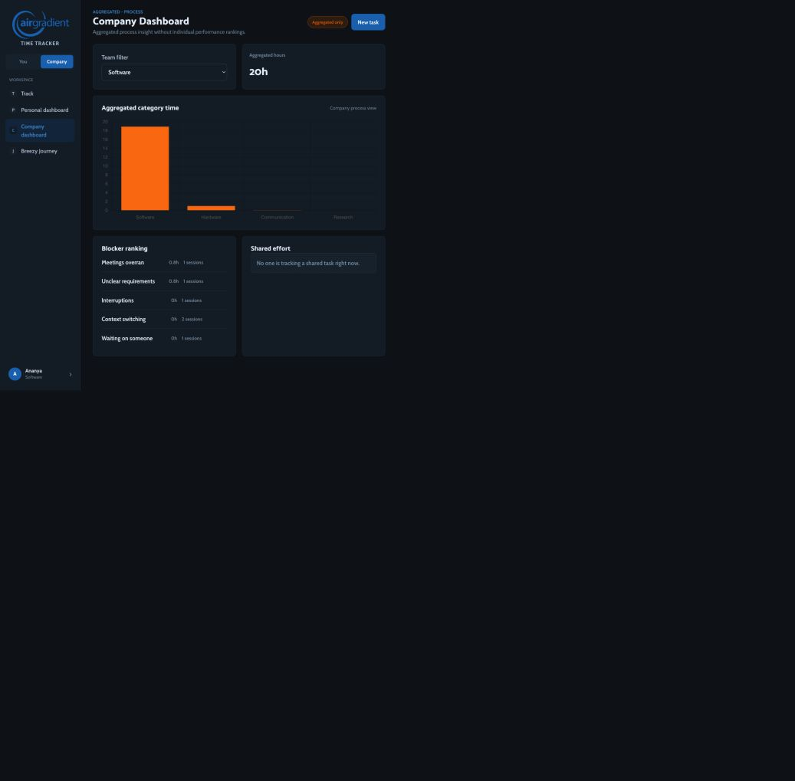
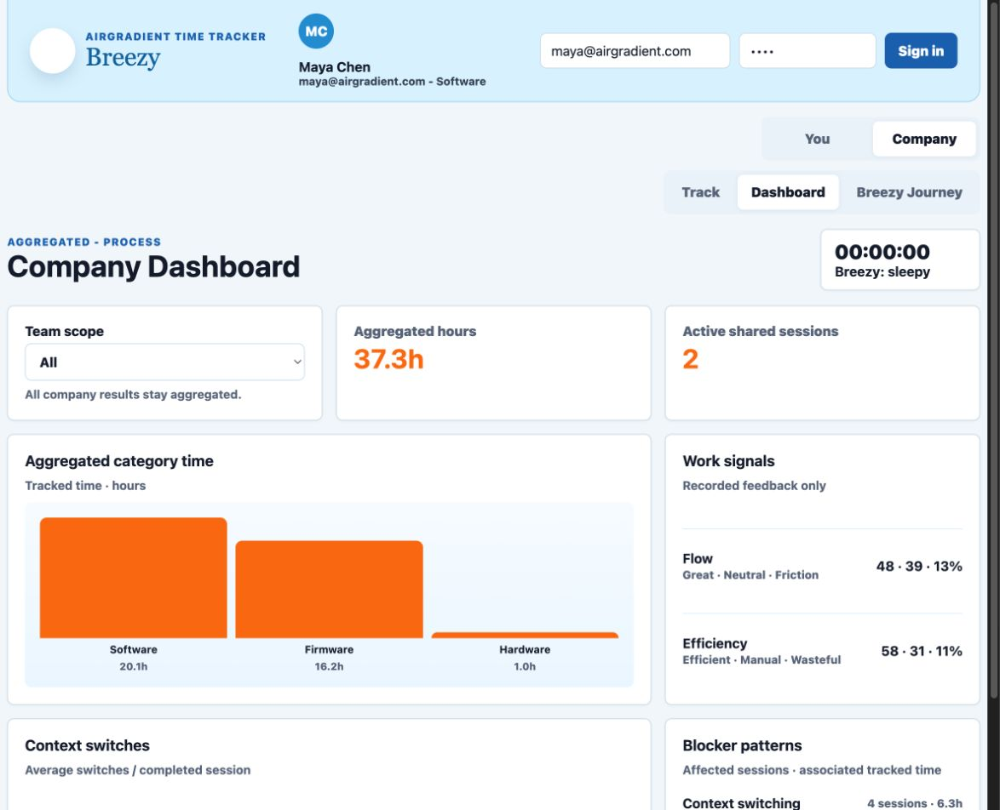

# Company Dashboard design audit

Date: 2026-09-09

## Overall verdict

The current dashboard has a sound privacy boundary and a working team filter, but it is incomplete as a process dashboard. Category time and blocker data are visible; Flow/Efficiency and context-switch trends are absent, and `Shared effort` describes activity rather than effort.

## Steps

### 1. Open the All-teams dashboard — Partially healthy

- Strength: the page is clearly marked `Aggregated only`, uses no people table, and makes category time the main visual.
- Issue: Flow, Efficiency, and context-switch trend are missing, so the page cannot yet explain changes in work quality or switching patterns.
- Issue: `Shared effort` shows an anonymous active-session state rather than effort; the label should be `Active shared sessions`.
- Accessibility risk: the category chart exposes only the generic accessible name `Hours chart`; it needs a data summary and explicit unit.
- Evidence limit: screenshot review does not prove keyboard order, screen-reader announcements, contrast ratios, or failed-request behavior.

### 2. Filter to Software — Healthy interaction, incomplete feedback

- Strength: changing the team visibly updates aggregate hours, category time, and blocker rows without revealing individual data.
- Issue: there is no visible loading or error state, so a slow or failed refresh could look like stale data.
- Issue: the selected scope changes existing cards, but the missing Work signals and context-switch trend leave the filtered view incomplete.
- Accessibility risk: the visible select has a label, but refresh status is not announced.
- Evidence limit: this run verified the successful Software state only; populated/empty/failure contracts require automated tests during implementation.

### 3. Review the proposed dashboard — Ready for implementation

- The proposal keeps the established desktop visual language while adding the missing Work signals and normalized context-switch trend.
- The Team scope control updates Aggregated hours, Active shared sessions, category time, Work signals, context-switch trend, and blockers together.
- The mock was exercised with both `All` and `Software`; the Software state changed every aggregate without exposing a person, task, entry, note, or location.
- Empty, loading, failure, keyboard, and screen-reader behavior remain implementation-time verification items.

## Agreed design direction

- Summary row: Team scope, Aggregated hours, Active shared sessions.
- Primary row: Aggregated category time plus recorded-only Flow/Efficiency percentages.
- Secondary row: Average context switches per completed session plus the top five blocker patterns.
- Team options come from persisted team names; all results remain anonymous aggregates.
